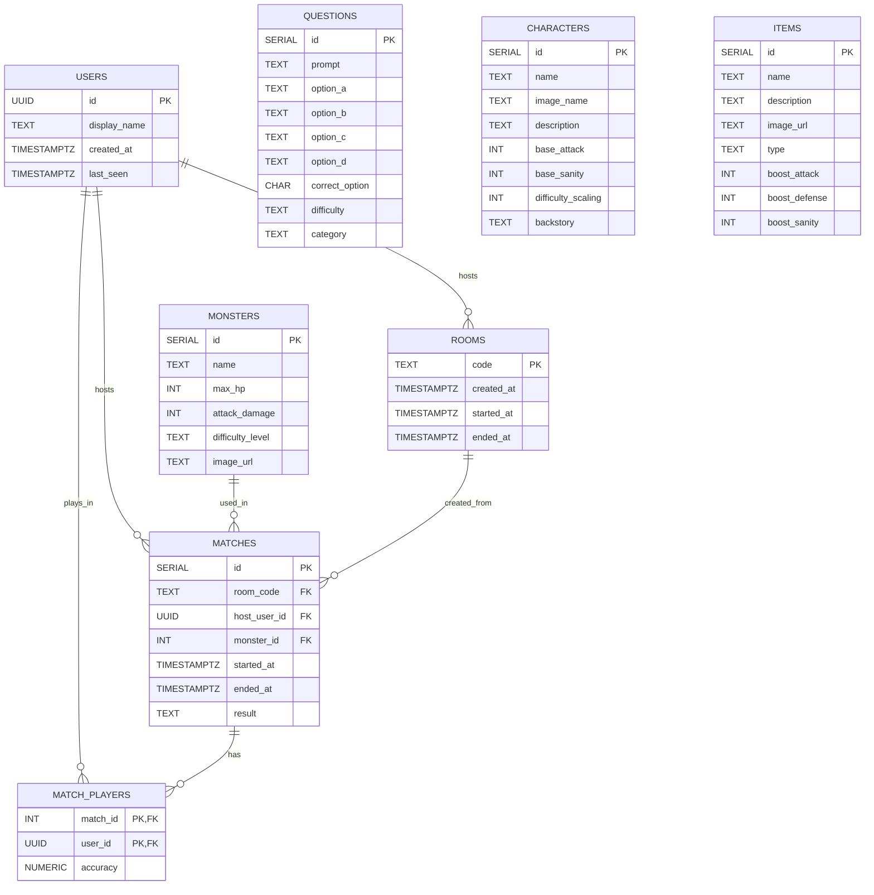

# Eldritch-Backend Initial Draft

## DB schema



USERS
Stores every player who has ever joined a room. Gets written to on socket joinRoom. Mainly exists so we can tie match history and accuracy stats back to the UUID and so that later on once we add user authentication we already have a user table.

QUESTIONS
Quiz content, seeded once, never written to during gameplay. The server reads from this on startGame to pick a set of questions for the match. Questions difficulty is "easy", "medium", "hard".

MONSTERS
Also static seed data. The server reads one row on startGame to get the monster's name and all other details. Monsters difficulty's level is "easy", "medium", "hard".

CHARACTERS
Static content. Not touched during game, it's here for when we add character picking before the lobby.

ROOMS
A record that a room existed. Written to when the host creates the room, and updated with started_at and ended_at as the game progresses. Useful for game history. N.B. the live game state lives in memory, not here.

MATCHES
The main record of a completed game, so we have a game history. Only written to at gameEnded. Links a room, a host, and a monster together with the outcome.

MATCH_PLAYERS
Junction table. One row per player per match, storing their accuracy score. Written to at gameEnded alongside the MATCHES row. We have it so we can build a leaderboard.

## In-memory game state

```js
  const roomStatusExample = {
    code: 'ABCD',
    hostUserId: 'uuid-123',
    roomStatus: 'in-game', // or "lobby" or "ended"
    players: [
      { 
      userId: 'uuid-123', 
      socketId: 'socket-1', 
      name: 'Alice', 
      character: {
        id: 1,
        name: 'The Scholar',
        image: 'character1.png',
        description: 'A seeker of forbidden knowledge.',
        base_attack: 5,
        base_sanity: 150,
        difficulty_scaling: 1,
        backstory: 'I'm 82 and I am very wise'
      }
    }
    ],
    currentStage: 1, // 1/2/3
    roundNumber: 1, // nth round across the whole game session
    teamHp: 150,
    monster: {
      id: 1,
      name: 'Skeleton Knight',
      max_hp: 80,
      attack_damage: 10,
      image_url: '',
      difficulty_level: 'easy'
    },
    monsterHp: 80,
    questionIds: [10, 25, 7, 3, 19],
    currentQuestionIndex: 0,
    currentQuestionId: 10,
    roundDeadline: Date.now() + 15000,
    timerId: {Timeout object},
    answers: {
      'uuid-123': null
    },
  };

  const rooms = { ABCD: roomStatusExample };
```

## Imporntant considerations

- No need for API endpoints at least initially
- No need for OOP, at least initially, just plain objects.

## Sockets : event schema

### joinRoom

**direction**: client to server  
**trigger**: user enters name + room code (or clicks "Create room").

**payload**:

```
{
  name: "string",
  roomCode: "string or empty"
  userId: "UUID",
  characterId: 1
}
```

**server side effects**:

- Update/add user in USERS table by UUID.
- If no roomCode: generate code, add row to ROOMS with created_at.
- If roomCode given: check room exists and is lobby status.
- Add to rooms[code] memory object: roomStatus "lobby", players array, hostUserId if needed.
- Socket joins the room.

**Emits in response**:

- Success (to room): lobbyUpdated with roomCode, hostUserId, players[], roomStatus.
- Error (to client): joinError with {message, code: "ROOM_NOT_FOUND" | "ROOM_FULL" | etc}.

---

### lobbyUpdated

**direction**: server to client  
**trigger**: after joinRoom, disconnect, or host change.

**payload**:

```
{
  roomCode: "string",
  hostUserId: "string",
  players: [{userId, name, character}],
  roomStatus: "lobby" | "in-game" | "ended"
}
```

**Sent to**: All in room.

**effects in front end**:

- Show Lobby screen.
- Update players list.
- Host sees Start button.

---

### startGame

**direction**: client to server  
**trigger**: host clicks Start.

**payload**: none — roomCode and userId are read server-side from socket.data.

**server side effects**:

- Check: room exists, caller is host, status lobby, 1+ players.
- Load monster, questions.
- Set rooms[code]: status "in-game", teamHp, monsterHp, questionIds[], currentQuestionIndex 0, roundDeadline, answers map empty.
- Emit roundStarted.

**Emits in response**:

- Success: roundStarted to room.
- Error: startError {message, code: "NOT_HOST" | etc}.
---

### roundStarted

**direction**: server to client  
**trigger**: after startGame or roundResult.

**payload**:

```
{
  monster: {
    name: "string",
    hp: number,
    maxHp: number,
    image: "string"
  },
  question: {
    prompt: "string",
    options: { a, b, c, d }
  },
  gameState: {
    teamHp: number,
    roundNumber: number,
    roundDeadline: number
  }
}
```

**Sent to**: All in room.

**effects in front end**:

- Show Battle screen.
- Display question + buttons.
- Start countdown.

---

### submitAnswer

**direction**: client to server  
**trigger**: player clicks answer.

**payload**:

```
{ questionId, answer: "a|b|c|d" }
```

**server side effects**:

- Check room in-game, question matches, before deadline.
- Save answer in rooms[code].answers[userId] if not set.
- When all answered or timeout:
  - Calc per-player correct, team/monster damage.
  - Update HPs.
  - If monsterHp <=0 → victory.
  - If teamHp <=0 → defeat.
  - Else next roundStarted.

**Emits in response**:

- Optional: answerAccepted to sender.
- Then: roundResult or gameEnded.
- Error: answerError

---

### roundResult

**direction**: server to client  
**trigger**: round resolved.

**payload**:

```
{
  roundNumber, questionId, correctOption,
  perPlayer: [{userId, name, answer, isCorrect}],
  teamDamageTaken, monsterDamageTaken,
  teamHpAfter, monsterHpAfter, isFinalRound
}
```

**Sent to**: All in room.

**effects in front end**:

- Show correct answer, who got it right/wrong.
- Update HP bars.
- Wait for next round or end.

---

### gameEnded

**direction**: server to client  
**trigger**: HP hits 0.

**payload**:

```
{
  result: "victory"|"defeat",
  monsterId, teamHpFinal, monsterHpFinal,
  perPlayerAccuracy: [{userId, name, accuracy}]
}
```

**server side effects**:

- Save MATCHES row: ended_at, result, etc.
- Save MATCH_PLAYERS with accuracy.
- Set roomStatus "ended".

**effects in front end**:

- Go to Victory/Game Over screen.
- Show final stats.

---
## Error Codes
### joinRoom errors
Event: `joinError` (server to client)

- `NO_NAME` – `"Name is required"`
- `NO_USER` – `"User is required"`
- `ROOM_NOT_FOUND` – `"Room not found"`
- `NO_CHARACTER` - `"Character selection is required"`
- `ROOM_IN_GAME` – `"Game already started"`
- `ROOM_ENDED` – `"Game has already ended"`
- `ROOM_FULL` – `"Room is full"`
- `SERVER_ERROR` - `"A server error occurred"`
  
Payload format: 
```js
{
  message: string,
  code: 'NO_NAME' |'NO_USER' | `NO_CHARACTER` | 'ROOM_NOT_FOUND' | 'ROOM_IN_GAME' | 'ROOM_ENDED' | 'ROOM_FULL` | 'SERVER_ERROR'
}
```
### startGame errors
Event: `startError` (server to client)  

- `NOT_HOST` – `"Only the host can start the game"`
- `WRONG_STATUS` – `"Room is not in lobby state"`
- `NOT_ENOUGH_PLAYERS` – `"At least x players are required to start"`

Payload:

```js
{
  message: string,
  code: 'NOT_HOST' | 'WRONG_STATUS' | 'NO_PLAYERS'
}
```
### submitAnswer errors
Event: `answerError` (server to client)  

`WRONG_STATUS` – `"Room is not in-game"`
`DEADLINE_PASSED` – `"The answer deadline has passed"`
`WRONG_QUESTION` – `"Question ID does not match current round"`
`ALREADY_ANSWERED` – `"You have already submitted an answer this round"`

Payload:
```js
{
  message: string,
  code: 'WRONG_STATUS' | 'DEADLINE_PASSED' | 'WRONG_QUESTION' | 'ALREADY_ANSWERED'
}
```
