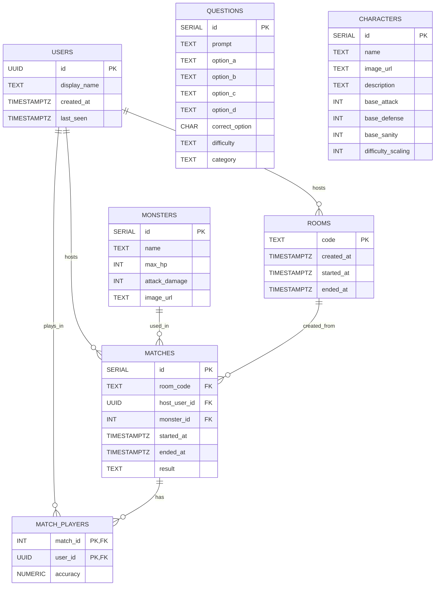

# Eldritch-Backend Initial Draft

## DB schema



## In-memory game state

```js
function roomExample() {
  const roomStatusExample = {
    code: 'ABCD',
    hostUserId: 'uuid-123',
    roomStatus: 'lobby', // or "in-game" or "ended"
    players: [
      { userId: 'uuid-123', socketId: 'socket-1', name: 'Alice' },
      { userId: 'uuid-456', socketId: 'socket-2', name: 'Bob' },
    ],
    teamHp: 100,
    monsterHp: 80,
    monsterId: 1,
    questionIds: [10, 25, 7, 3, 19],
    currentQuestionIndex: 0,
    currentQuestionId: 10,
    roundDeadline: Date.now() + 15000,
    answers: {
      'uuid-123': null,
      'uuid-456': null,
    },
  };

  // Globaltore for all active rooms
  const rooms = { ABCD: roomStatusExample };
}
```

## Imporntant considerations

- No need for API endpoints at least initially
- No need for OOP, at least initially, just plain objects.

## Sockets : event schema

### joinRoom

**direction**: client to server  
**trigger**: user enters name + room code (or clicks "Create room").

**payload**:

```
{
  name: "string",
  roomCode: "string or empty"
}
```

**server side effects**:

- Update/add user in USERS table by UUID.
- If no roomCode: generate code, add row to ROOMS with created_at.
- If roomCode given: check room exists and is lobby status.
- Add to rooms[code] memory object: roomStatus "lobby", players array, hostUserId if needed.
- Socket joins the room.

**Emits in response**:

- Success (to room): lobbyUpdated with roomCode, hostUserId, players[], roomStatus.
- Error (to client): joinError with {message, code: "ROOM_NOT_FOUND" | "ROOM_FULL" | etc}.

**error cases**:

- Room doesn't exist.
- Room in-game or ended.
- Room full (4 players).
- No name.

---

### lobbyUpdated

**direction**: server to client  
**trigger**: after joinRoom, disconnect, or host change.

**payload**:

```
{
  roomCode: "string",
  hostUserId: "string",
  players: [{userId, name}],
  roomStatus: "lobby" | "in-game" | "ended"
}
```

**Sent to**: All in room.

**effects in front end**:

- Show Lobby screen.
- Update players list.
- Host sees Start button.

**error cases**: None.

---

### startGame

**direction**: client to server  
**trigger**: host clicks Start.

**payload**:

```
{ roomCode: "string" }
```

**server side effects**:

- Check: room exists, caller is host, status lobby, 1+ players.
- Load monster, questions.
- Set rooms[code]: status "in-game", teamHp, monsterHp, questionIds[], currentQuestionIndex 0, roundDeadline, answers map empty.
- Emit roundStarted.

**Emits in response**:

- Success: roundStarted to room.
- Error: startError {message, code: "NOT_HOST" | etc}.

**error cases**:

- Not host.
- Room wrong status.
- No players.

---

### roundStarted

**direction**: server to client  
**trigger**: after startGame or roundResult.

**payload**:

```
{
  roomCode, roundNumber, questionId,
  prompt, options: {a,b,c,d},
  roundDeadline, teamHp, monsterHp
}
```

**Sent to**: All in room.

**effects in front end**:

- Show Battle screen.
- Display question + buttons.
- Start countdown.

**error cases**: None.

---

### submitAnswer

**direction**: client to server  
**trigger**: player clicks answer.

**payload**:

```
{ roomCode, questionId, answer: "a|b|c|d" }
```

**server side effects**:

- Check room in-game, question matches, before deadline.
- Save answer in rooms[code].answers[userId] if not set.
- When all answered or timeout:
  - Calc per-player correct, team/monster damage.
  - Update HPs.
  - If monsterHp <=0 → victory.
  - If teamHp <=0 → defeat.
  - Else next roundStarted.

**Emits in response**:

- Optional: answerAccepted to sender.
- Then: roundResult or gameEnded.

**error cases**:

- After deadline.
- Wrong question.

---

### roundResult

**direction**: server to client  
**trigger**: round resolved.

**payload**:

```
{
  roomCode, roundNumber, questionId, correctOption,
  perPlayer: [{userId, name, answer, isCorrect}],
  teamDamageTaken, monsterDamageTaken,
  teamHpAfter, monsterHpAfter, isFinalRound
}
```

**Sent to**: All in room.

**effects in front end**:

- Show correct answer, who got it right/wrong.
- Update HP bars.
- Wait for next round or end.

**error cases**: None.

---

### gameEnded

**direction**: server to client  
**trigger**: HP hits 0.

**payload**:

```
{
  roomCode, result: "victory"|"defeat",
  monsterId, teamHpFinal, monsterHpFinal,
  perPlayerAccuracy: [{userId, name, accuracy}]
}
```

**server side effects**:

- Save MATCHES row: ended_at, result, etc.
- Save MATCH_PLAYERS with accuracy.
- Set roomStatus "ended".

**effects in front end**:

- Go to Victory/Game Over screen.
- Show final stats.

**error cases**: None.

---
